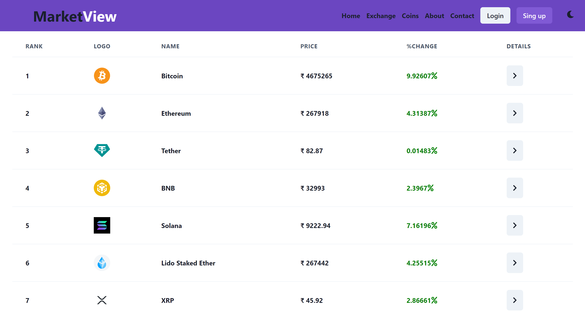
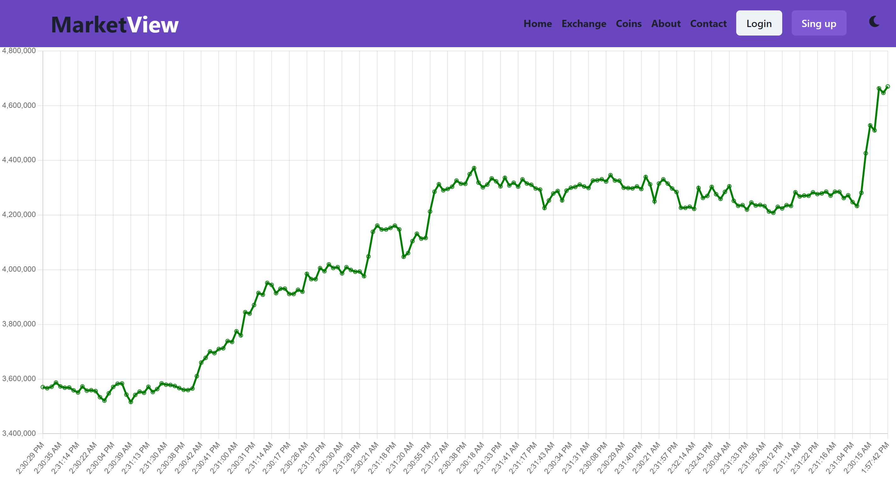

# Cripzz - Cryptocurrency Tracking Website

Cripzz is a web application designed to track cryptocurrency prices and exchanges. It provides users with real-time data on various cryptocurrencies along with interactive graphs for different time intervals.

## Features

<<<<<<< HEAD
- **User-friendly Interface**: The website is designed with a clean and intuitive interface to ensure ease of use for users.

- **Real-time Data**: Cripzz fetches live data from the CoinGecko API to provide users with up-to-date information on cryptocurrency prices.

- **Interactive Graphs**: Users can visualize the price trends of cryptocurrencies over different time intervals such as 1 day, 7 days, 30 days, and 1 year using Chart.js library.

- **Detailed Information**: Cripzz offers detailed information about each cryptocurrency, including market cap, trading volume, circulating supply, and more.

## Technologies Used

- **React**: Cripzz is built using React, a popular JavaScript library for building user interfaces.
- **API Integration**: The website integrates with the CoinGecko API to fetch real-time data.
- **Charting Library**: Interactive graphs are implemented using Chart.js, a JavaScript library for creating responsive and customizable charts.
- **Vercel**: The website is deployed on Vercel, a platform for deploying serverless functions and static websites.

## Usage

To run the application locally:

1. Clone this repository.
2. Install dependencies using `npm install`.
3. Start the development server using `npm start`.
4. Open `http://localhost:3000` in your web browser.

## Contributing

Contributions are welcome! If you have any ideas for improvements or feature requests, please open an issue or submit a pull request.

## License

This project is licensed under the [MIT License](LICENSE).

## Acknowledgments

=======
- **Real-time Data**: Cripzz fetches live data from the CoinGecko API to provide users with up-to-date information on cryptocurrency prices.
- **Interactive Graphs**: Users can visualize the price trends of cryptocurrencies over different time intervals such as 1 day, 7 days, 30 days, and 1 year using Chart.js library.
- **Detailed Information**: Cripzz offers detailed information about each cryptocurrency, including market cap, trading volume, circulating supply, and more.
- **User-friendly Interface**: The website is designed with a clean and intuitive interface to ensure ease of use for users.

## Technologies Used

- **React**: Cripzz is built using React, a popular JavaScript library for building user interfaces.
- **API Integration**: The website integrates with the CoinGecko API to fetch real-time data.
- **Charting Library**: Interactive graphs are implemented using Chart.js, a JavaScript library for creating responsive and customizable charts.
- **Vercel**: The website is deployed on Vercel, a platform for deploying serverless functions and static websites.

## Usage

To run the application locally:

1. Clone this repository.
2. Install dependencies using `npm install`.
3. Start the development server using `npm start`.
4. Open `http://localhost:3000` in your web browser.

## Contributing

Contributions are welcome! If you have any ideas for improvements or feature requests, please open an issue or submit a pull request.

## License

This project is licensed under the [MIT License](LICENSE).

## Acknowledgments

>>>>>>> d93872f66e321b3f93913a40f911a36821c29aaf
- The developers of the CoinGecko API for providing cryptocurrency data.
- The creators of React and Chart.js, and other open-source libraries used in the development of this website.
